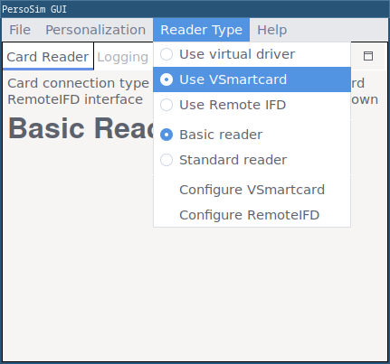
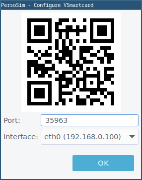
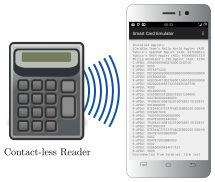
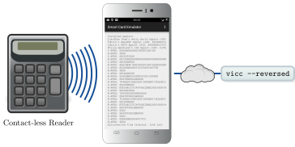
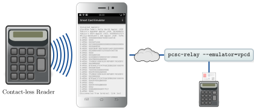

# Android Smart Card Emulator

> **Use an Android phone as contact-less smart card**
> **License:** GPL version 3
> **Tested Platforms:** Android

The Android Smart Card Emulator allows the emulation of a contact-less smart card.
The emulator uses Android's HCE (host card emulation) to fetch APDUs from a contact-less reader.
The app allows to process the Command APDUs either by delegating them to a
remote virtual smart card or by a built-in Java Card simulator. The response
APDUs are then returned to the smart card reader. Together with
[Tizen Smart Card Emulator](https://frankmorgner.github.io/vsmartcard/TCardEmulator/README.html) it is also possible to use a smartwatch as communication
device instead of the phone.

With the built-in Java Card runtime of [jCardSim](http://www.jcardsim.org/) the app includes the following
Applets:

- [OpenPGP Applet](https://developers.yubico.com/ykneo-openpgp/) (application identifier `D2760001240102000000000000010000`)
- [OATH Applet](https://developers.yubico.com/ykneo-oath/) (application identifier `A000000527210101`)
- [ISO Applet](http://www.pwendland.net/IsoApplet/) (application identifier `F276A288BCFBA69D34F31001`)
- [GIDS Applet](https://github.com/vletoux/GidsApplet) (application identifier `A000000397425446590201`)

The remote interface can be used together with the [Virtual Smart Card](https://frankmorgner.github.io/vsmartcard/virtualsmartcard/README.html), which allows
emulating the following cards:

- Generic ISO-7816 smart card
- German electronic identity card (nPA)
- Electronic passport

The remote interface can also be used together with the [PC/SC Relay](https://frankmorgner.github.io/vsmartcard/pcsc-relay/README.html),
which allows emulating a contactless card from an existing contact-based card
(by relaying the commands from PC/SC to the phone).

An additional way of simulating a german electronic identity card (nPA) is
PersoSim in version 1.2.0 or newer. (`PersoSim <https://persosim.de>`_).
Select "VSmartcard" in the "Interface" menu and connect from the smartphone. The
"Configure VSmartcard" menu entry opens a dialog for setting the port to be used
and shows an QR-code for each network interface that can be scanned in the app.
PersoSim tries to listen for connections on all available interfaces but you
need to select an interface where the phone is reachable to get a valid QR code.





The official eID-client [AusweisApp](https://www.ausweisapp.bund.de/home)
can then be used to access the simulated card usind the different profiles
included in PersoSim.

You may also attach your own simulation to the remote interface by implementing
a simple interface through a socket communication.





The Android Smart Card Emulator has the following dependencies:

- NFC hardware built into the smartphone for HCE
- Android 4.4 "KitKat" (or newer) or CyanogenMod 11 (or newer)
- permissions for a data connection (communication with Virtual Smart Card) and
  for using NFC (communication to the reader); scanning the configuration via
  QR code requires permission to access the camera
- Virtual Smart Card installed on the host computer for
  using the remote interface

Please note that the currently emulated applets are verifying the PIN by
transmitting it without any protection between card and terminal. You may want
to have a look at [Erik Nellesson's](http://sar.informatik.hu-berlin.de/research/publications/SAR-PR-2014-08/SAR-PR-2014-08_.pdf)
[Virtual Keycard](https://github.com/eriknellessen/Virtual-Keycard), which uses the PACE protocol for PIN verification.

## Download and Install

The Android Smart Card Emulator is available on [F-Droid](https://f-droid.org/repository/browse/?fdid=com.vsmartcard.remotesmartcardreader.app).

<!-- qr code generated via http://www.qrcode-monkey.de -->

<!-- icon generated via https://romannurik.github.io/AndroidAssetStudio/icons-launcher.html#foreground.type=clipart&foreground.space.trim=0&foreground.space.pad=0.25&foreground.clipart=res%2Fclipart%2Ficons%2Fdevice_nfc.svg&foreColor=fdd017%2C0&crop=0&backgroundShape=hrect&backColor=ffffff%2C100&effects=shadow -->

[](https://f-droid.org/repository/browse/?fdid=com.vsmartcard.acardemulator)

To manually compile the app you need to fetch the sources and initialize the
submodules:

```sh
git clone https://github.com/frankmorgner/vsmartcard.git
cd vsmartcard
git submodule update --init --recursive
```

We use [Android Studio](http://developer.android.com/sdk/installing/studio.html) to build and deploy the application. Use
`File --> Open` to select `vsmartcard/ACardEmulator`.
Attach your smartphone and choose `Run --> Run 'app'`.

## Question

Do you have questions, suggestions or contributions? Feedback of any kind is
more than welcome! Please use our [project trackers](https://github.com/frankmorgner/vsmartcard/issues).
