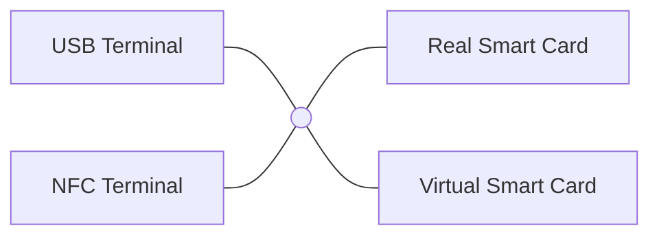

# Virtual Smart Card Architecture

Welcome to the Virtual Smart Card Architecture. Virtual Smart Card Architecture is an umbrella project for various
projects concerned with the emulation of different types of smart card readers
or smart cards themselves.



Currently the following projects are part of Virtual Smart Card Architecture: 

- [Virtual Smart Card](virtualsmartcard/README.md)
- [Remote Smart Card Reader](remote-reader/README.md)
- [Android Smart Card Emulator](ACardEmulator/README.md)
- [TCardEmulator](TCardEmulator/README.md)
- [PC/SC Relay](pcsc-relay/README.md)
- [USB CCID Emulator](ccid/README.md)

[](https://github.com/frankmorgner/vsmartcard/actions/workflows/ci.yml?branch=master) [](https://ci.appveyor.com/project/frankmorgner/vsmartcard) [](https://scan.coverity.com/projects/3987)

## Download

You can download the latest release of the Virtual Smart Card Architecture [here](https://github.com/frankmorgner/vsmartcard/releases). Older releases are still available at the [old project location](http://sourceforge.net/projects/vsmartcard/files).

Alternatively, you can clone our git repository:

```sh
git clone https://github.com/frankmorgner/vsmartcard.git
```

## References

- Frank Morgner and Dominik Oepen. "Die gesamte Technik ist sicher". Besitz und Wissen: Relay-Angriffe auf den neuen Personalausweis. 27th Chaos Communication Congress, December 2010. [Link](http://media.ccc.de/browse/congress/2010/27c3-4297-de-die_gesamte_technik_ist_sicher.html)
- Wolf Müller, Frank Morgner and Dominik Oepen. Mobiles Szenario für den neuen Personalausweis. Tagungsband zum 21. SIT-SmartCard Workshop, 2011.
- Dominik Oepen. Authentisierung im mobilen Web: Zur Usability eID-basierter Authentisierung auf einem NFC Handy. Diplomarbeit, Humboldt-Universität zu Berlin, 2010.
- Frank Morgner, Dominik Oepen, Wolf Müller and Jens-Peter Redlich. Mobile Smart Card Reader Using NFC-Enabled Smartphones. Security and Privacy in Mobile Information and Communication Systems, 2012.
- Frank Morgner. Mobiler Chipkartenleser für den neuen Personalausweis: Sicherheitsanalyse und Erweiterung des "Systems nPA". Diplomarbeit, Humboldt-Universität zu Berlin, 2012.
- Dominik Oepen and Frank Morgner. FOSS im Umfeld des neuen Personalausweis. LinuxTag 2011.
