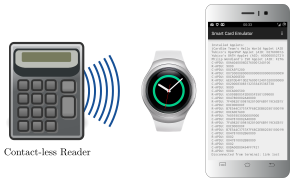

# Tizen Smart Card Emulator

> **Use a Tizen smartwatch as contact-less smart card**
> **License:** GPL version 3
> **Tested Platforms:** Tizen (Samsung Gear S2)

The Tizen Smart Card Emulator allows the emulation of a contact-less smart card.
The emulator uses Tizen's HCE (host card emulation) to fetch APDUs from a contact-less reader.
The headless Tizen service delegates the Command APDUs via Samsung's Accessory
Protocol to the [Android Smart Card Emulator](https://frankmorgner.github.io/vsmartcard/ACardEmulator/README.md). The Android app processes the commands and
sends responses back to the contact-less reader via the Tizen Smart Card
Emulator.

You may also attach your own simulation by using the Samsung Accessory Protocol
for communicating with the Tizen service.



## Download and Install

To manually compile the app you need to fetch the sources and initialize the
submodules:

```sh
git clone https://github.com/frankmorgner/vsmartcard.git
```

We use [Tizen SDK](https://developer.tizen.org/development/tools/download) to build and deploy the application. Use
`Import...` to select `Tizen --> Tizen Project`.
In the next dialog choose `Tizen/TCardEmulator`. To be able to build and
install the Tizen service on the smartwatch, you need to [install the appropriate SDK extensions and register as app developer](https://developer.tizen.org/community/tip-tech/tizen-sdk-install-guide-certificate-extensions-included).

More usefull ressources:

- [Tizen Developers: Near Field Communication (NFC)](https://developer.tizen.org/development/guides/native-application/connectivity-and-wireless/nfc)
- [Programming Guide: Accessory](http://developer.samsung.com/html/techdoc/ProgrammingGuide_Accessory.pdf)
- [Guidelines on Connecting a Gear S2 Device Using Wi-Fi](http://developer.samsung.com/html/techdoc/Guidelines_on_Connecting_GearS2_device_using_WiFi_151222.pdf)

## Question

Do you have questions, suggestions or contributions? Feedback of any kind is
more than welcome! Please use our [project trackers](https://github.com/frankmorgner/vsmartcard/issues).
