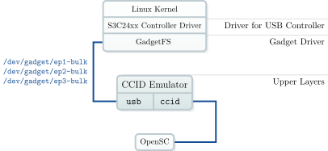

# USB CCID Emulator

> **Emulate a USB CCID compliant smart card reader**
> **License:** GPL version 3
> **Tested Platforms:** Linux (Debian, Ubuntu, OpenMoko)

The USB CCID Emulator forwards a locally present PC/SC smart card reader as a
standard USB CCID reader. USB CCID Emulator can be used as trusted intermediary
enabling secure PIN entry and PIN modification. In combination with [OpenSC](https://github.com/frankmorgner/OpenSC)
also PACE can be performed by the emulator.


If the machine running `ccid-emulator` is in USB device mode, a local
reader is forwareded via USB to another machine. If in USB host mode, the USB
CCID reader will locally be present.

Applications on Windows and Unix-like systems can access the USB CCID Emulator
through PC/SC as if it was a real smart card reader. No installation of a smart
card driver is required since USB CCID drivers are usually shipped with the
modern OS.

Here is a subset of USB CCID commands supported by the USB CCID Emulator with
their PC/SC counterpart:

| USB CCID | PC/SC |
|----------|-------|
| `PC_to_RDR_XfrBlock` | `SCardTransmit` |
| `PC_to_RDR_Secure` | `FEATURE_VERIFY_PIN_DIRECT`, `FEATURE_MODIFY_PIN_DIRECT` |
| `PC_to_RDR_Secure` (proprietary) | `FEATURE_EXECUTE_PACE` |

PIN verification/modification and PACE can also be started by the application
transmitting (SCardTransmit) specially crafted APDUs. Only the alternative
initialization of PACE using SCardControl requires patching the driver
(available for libccid, see `patches`). The pseudo APDUs with no need for
patches are defined as follows (see [BSI TR-03119 1.3](https://www.bsi.bund.de/DE/Publikationen/TechnischeRichtlinien/tr03119/index_htm.html) p. 33-34):

| Command | CLA | INS | P1 | P2 | Command Data | Response Data | SW1/SW2 |
|---------|-----|-----|----|----|--------------|---------------|---------|
| GetReaderPACECapabilities | `0xFF` | `0x9A` | `0x04` | `0x01` | (No Data) | `PACECapabilities` | `0x9000` or other in case of an error |
| EstablishPACEChannel | `0xFF` | `0x9A` | `0x04` | `0x02` | `EstablishPACEChannelInput` | `EstablishPACEChannelOutput` | (same as above) |
| DestroyPACEChannel | `0xFF` | `0x9A` | `0x04` | `0x03` | (No Data) | (No Data) | (same as above) |
| Verify/Modify PIN | `0xFF` | `0x9A` | `0x04` | `0x10` | Coding as `PC_to_RDR_Secure` | Coding as `RDR_to_PC_DataBlock` | (same as above) |

The USB CCID Emulator is implemented using [GadgetFS](http://www.linux-usb.org/gadget/). Some fragments of the source
code are based on the GadgetFS example and on the source code of the OpenSC
tools.



Whereas using the USB CCID Emulator on the host system as smart card reader only
needs a usable PC/SC middleware with USB CCID driver. This is the case for most
modern Windows and Unix-like systems by default.


## Download

You can find the latest release of USB CCID Emulator on [Github](https://github.com/frankmorgner/vsmartcard/releases). Older releases are
still available on [Sourceforge](http://sourceforge.net/projects/vsmartcard/files).

Alternatively, you can clone our git repository:

```sh
git clone https://github.com/frankmorgner/vsmartcard.git
cd vsmartcard
git submodule update --init --recursive
```

## Installation

### Installation on Linux, Unix and similar

The USB CCID Emulator uses the GNU Build System to compile and install. If you are
unfamiliar with it, please have a look at `INSTALL`. If you can not find
it, you are probably working bleeding edge in the repository. To generate the
missing standard auxiliary files you need to additionally install `libtool` and
`pkg-config` and run the following command in `ccid`:

```sh
autoreconf --verbose --install
```

To configure (`configure --help` lists possible options), build and
install the USB CCID Emulator now do the following:

```sh
./configure --sysconfdir=/etc
make
make install
```

The USB CCID Emulator depends on `libopensc`, which is automatically
built from a snapshot of the [OpenSC](https://github.com/frankmorgner/OpenSC) source code and then statically linked.

Running the USB CCID Emulator has the following dependencies:

- Linux Kernel with [GadgetFS](http://www.linux-usb.org/gadget/)
- [OpenSSL](https://www.openssl.org) 1.0.0 or later

### Hints on GadgetFS

To create a USB Gadget in both USB host and USB client mode, you need to load
the kernel module `gadgetfs`. Here is how to get a running version of
GadgetFS on a Debian system (see also [OpenMoko Wiki](http://wiki.openmoko.org/wiki/Building_Gadget_USB_Module)):

```sh
sudo apt-get install linux-source linux-headers-`uname -r`
sudo tar xjf /usr/src/linux-source-*.tar.bz2
cd linux-source-*/drivers/usb/gadget
# build dummy_hcd and gadgetfs
echo "KDIR := /lib/modules/`uname -r`/build" >> Makefile
echo "PWD := `pwd`" >> Makefile
echo "obj-m := dummy_hcd.o gadgetfs.o" >> Makefile
echo "default: " >> Makefile
echo -e "\t\$(MAKE) -C \$(KDIR) SUBDIRS=\$(PWD) modules" >> Makefile
make
# load GadgetFS with its dependencies
sudo modprobe udc-core
sudo insmod ./dummy_hcd.ko
sudo insmod ./gadgetfs.ko default_uid=`id -u`
# mount GadgetFS
sudo mkdir /dev/gadget
sudo mount -t gadgetfs gadgetfs /dev/gadget
```

On OpenMoko it is likely that you need to [patch your kernel](http://docs.openmoko.org/trac/ticket/2206). If you also want to switch
multiple times between `gadgetfs` and `g_ether`, [another patch is needed](http://docs.openmoko.org/trac/ticket/2240).

If you are using a more recent version of `dummy_hcd` and get an error
loading the module, you maybe want to check out [this patch](http://comments.gmane.org/gmane.linux.usb.general/47440).

## Usage

The USB CCID Emulator has various command line options to customize the appearance
on the USB host. In order to run the USB CCID Emulator GadgetFS must be loaded
and mounted. The USB CCID Emulator is compatible with the unix driver [libccid](https://ccid.apdu.fr/)
and the [Windows USB CCID driver](http://msdn.microsoft.com/en-us/windows/hardware/gg487509). PIN commands are supported if implemented
by the driver.

> [!NOTE]
> **Version added: 0.7**
> USB CCID Emulator now supports the boxing commands defined in [BSI TR-03119 1.3](https://www.bsi.bund.de/DE/Publikationen/TechnischeRichtlinien/tr03119/index_htm.html).

```
Usage: ccid-emulator [OPTION]...
Emulate a USB CCID compliant smart card reader

  -h, --help               Print help and exit
  -V, --version            Print version and exit
  -i, --info               Print available readers and drivers.  (default=off)
  -r, --reader=INT         Number of the PC/SC reader to use (-1 for
                             autodetect)  (default=`-1')
      --gadgetfs=FILENAME  Directory where GadgetFS is mounted
                             (default=`/dev/gadget')
  -v, --verbose            Use (several times) to be more verbose

Changing the appearance on the Universal Serial Bus:
  -p, --product=INT        USB product ID  (default=`0x3010')
  -e, --vendor=INT         USB vendor ID  (default=`0x0D46')
      --serial=STRING      USB serial number  (default=`random')
      --interface=STRING   USB serial number  (default=`notification status')
      --interrupt          Add interrupt pipe for CCID  (default=off)

Report bugs to https://github.com/frankmorgner/vsmartcard/issues

Written by Frank Morgner <frankmorgner@gmail.com>
```

## Question

Do you have questions, suggestions or contributions? Feedback of any kind is
more than welcome! Please use our [project trackers](https://github.com/frankmorgner/vsmartcard/issues).
