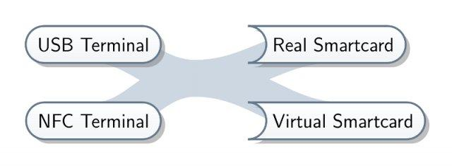
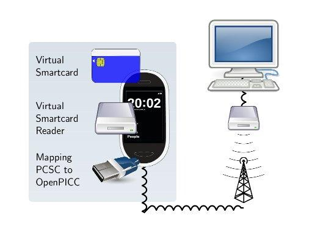
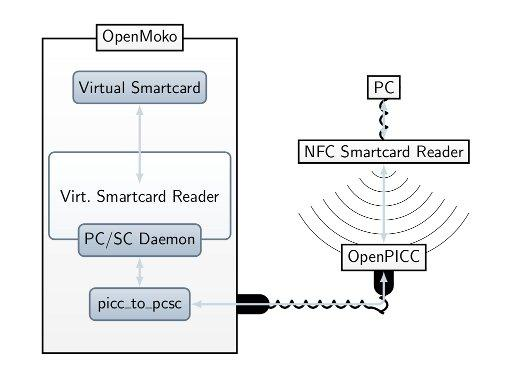
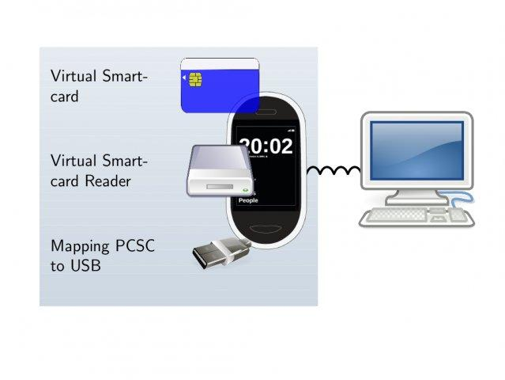
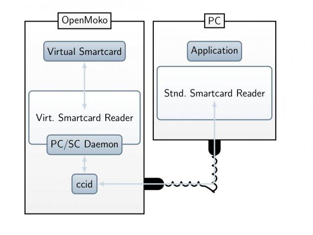

.. |vsmartcard| replace:: Virtual Smart Card Architecture

Welcome to the |vsmartcard| documentation!
==========================================================

Welcome to the |vsmartcard|. |vsmartcard| is an umbrella project for various
projects concerned with the emulation of different types of smart card readers
or smart cards themselves.

Currently the following projects are part of |vsmartcard|: 

.. toctree::
   :titlesonly:

   virtualsmartcard/README
   pcsc-relay/README
   ccid/README
   npa/README

Looking for a feature the included programs do not offer? Want to extend the
functionality of some library? Apart from requesting a new feature, you can
have a look at these programming guides and try yourself:

.. toctree::
   :maxdepth: 1

   virtualsmartcard/api
   npa/api

Example Use Cases
-----------------

Mobile Phone with Virtual Smartcard connected via NFC
*****************************************************

Mobile Phone with Virtual Smartcard connected via USB
*****************************************************

Download
========

You can download the latest release of the |vsmartcard| `here <https://sourceforge.net/projects/vsmartcard/files/vsmartcard_2011-05-20.tar.gz/download>`_.

Alternatively you can check out the source code from our `subversion repository <https://sourceforge.net/projects/vsmartcard/develop>`_. 
