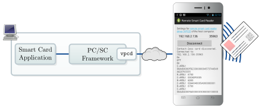
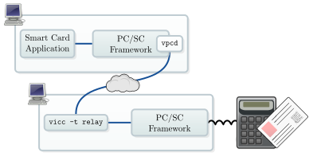
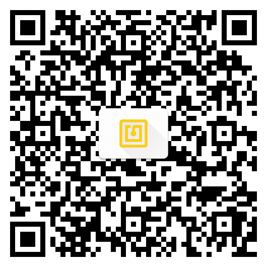

# Remote Smart Card Reader

> **Use an Android phone as contact-less smart card reader**
> **License:** GPL version 3
> **Tested Platforms:** Android, CyanogenMod

Allow a host computer to use the smartphone's NFC hardware as contact-less
smartcard reader. On the host computer a special smart card driver,
[vpcd](http://frankmorgner.github.io/vsmartcard/virtualsmartcard/README.html),
must be installed. The app establishes a connection to vpcd over the network
when a contact-less card is detected.



The Remote Smart Card Reader has the following dependencies:

- NFC hardware built into the smartphone
- Android 4.4 "KitKat" or CyanogenMod 11 (or newer)
- permissions for a data connection (communication with vpcd) and for using
  NFC (communication to the card); scanning the configuration via QR code
  requires permission to access the camera
- [vpcd](http://frankmorgner.github.io/vsmartcard/virtualsmartcard/README.html) installed on the host computer

For remotely accessing a traditional smart card reader on one computer from an
other computer, the [virtual smart card](http://frankmorgner.github.io/vsmartcard/virtualsmartcard/README.html) in relay mode can be used:


<!-- missing include relay-note.txt -->

## Download and Install

The Remote Smart Card Reader is available on [F-Droid].

<!-- qr code generated via http://www.qrcode-monkey.de -->
<!-- icon generated via https://romannurik.github.io/AndroidAssetStudio/icons-launcher.html#foreground.type=clipart&foreground.space.trim=0&foreground.space.pad=0.25&foreground.clipart=res%2Fclipart%2Ficons%2Fnotification_tap_and_play.svg&foreColor=fdd017%2C0&crop=0&backgroundShape=hrect&backColor=ffffff%2C100&effects=shadow -->

[](https://f-droid.org/repository/browse/?fdid=com.vsmartcard.remotesmartcardreader.app)

To manually compile the app you need to fetch the sources:

```sh
git clone https://github.com/frankmorgner/vsmartcard.git
```

We use [Android Studio](http://developer.android.com/sdk/installing/studio.html) to build and deploy the application. Use
`File --> Open` to select `vsmartcard/remote-reader`.
Attach your smartphone and choose `Run --> Run 'app'`.

On the host system, where the smart card at the phone's NFC interface is relayed to,
vpcd needs to be installed. It can be installed on Windows and Unix. On the
host computer, `vpcd-config` prints a QR code to configure the Remote
Smart Card Reader. Scan the configuration with the bar code scanner of your
choice.

## Question

Do you have questions, suggestions or contributions? Feedback of any kind is
more than welcome! Please use our [project trackers](https://github.com/frankmorgner/vsmartcard/issues).
