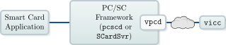

# Virtual Smart Card

> **Smart card emulator written in Python**
> **License:** GPL version 3
> **Tested Platforms:** Windows, macOS, Linux (Debian, Ubuntu, OpenMoko)

Virtual Smart Card emulates a smart card and makes it accessible through PC/SC.
Currently the Virtual Smart Card supports the following types of smart cards:

- Generic ISO-7816 smart card including secure messaging
- German electronic identity card (nPA) with complete support for EAC (PACE, TA, CA)
- Electronic passport (ePass/MRTD) with support for BAC
- Cryptoflex smart card (incomplete)
      
The vpcd is a smart card reader driver for [PCSC-Lite](https://pcsclite.apdu.fr/) and the windows smart
card service. It allows smart card applications to access the vpicc through
the PC/SC API. By default vpcd opens slots for communication with multiple
vpicc's on localhost on port 35963 and port 35964. But the vpicc does not
need to run on the same machine as the vpcd, they can connect over the
internet for example.

Although the Virtual Smart Card is a software emulator, you can use
`pcsc-relay` to make it accessible to an external contact-less smart card
reader.

The file `utils.py` was taken from Henryk Plötz's [cyberflex-shell](https://github.com/henryk/cyberflex-shell).



> [!NOTE]
> **Version added: 0.7**
> The Virtual Smart Card optionally brings its own standalone implementation of
> PC/SC. This allows accessing vpicc without PCSC-Lite. Our PC/SC
> implementation acts as replacement for `libpcsclite` which can lead to
> problems when used in parallel with PCSC-Lite.


On Android, where a traditional PC/SC framework is not available, you can use
our framework to make your real contact-less smart accessible through PKCS#11.
For example, an email signing application can use the PKCS#11 interface of
OpenSC, which is linked against our PC/SC implementation. Then an Android App
(e.g. `remote-reader`) can connect as vpicc delegating all requests and
responses via NFC to a contact-less smart card that signs the mail.

Depending on your usage of the vpicc you may need to install the following:

- [Python](http://www.python.org/)
- [pyscard](http://pyscard.sourceforge.net/) (relaying a local smart card with `--type=relay`)
- [PyCryptodome](https://www.pycryptodome.org/), [PBKDF2](https://www.dlitz.net/software/python-pbkdf2/), [PIL](http://www.pythonware.com/products/pil/), [readline](https://docs.python.org/3.3/library/readline.html) or [PyReadline](https://pypi.python.org/pypi/pyreadline) (emulation of electronic
  passport with `--type=ePass`)
- [OpenPACE](https://github.com/frankmorgner/openpace) (emulation of German identity card with `--type=nPA`)
- [libqrencode](https://fukuchi.org/works/qrencode/) (to print a QR code on the command line for `vpcd-config`; an
  URL will be printed if libqrencode is not available)

## Download

You can find the latest release of Virtual Smart Card on [Github](https://github.com/frankmorgner/vsmartcard/releases). Older releases are
still available on [Sourceforge](http://sourceforge.net/projects/vsmartcard/files).

Alternatively, you can clone our git repository:

```sh
git clone https://github.com/frankmorgner/vsmartcard.git
cd vsmartcard
git submodule update --init --recursive
```

## Installation

### Installation on Linux, Unix and similar

The Virtual Smart Card uses the GNU Build System to compile and install. If you are
unfamiliar with it, please have a look at `INSTALL`. If you can not find
it, you are probably working bleeding edge in the repository. To generate the
missing standard auxiliary files you need to additionally install `libtool` and
`pkg-config` and run the following command in `virtualsmartcard`:

```sh
autoreconf --verbose --install
```

To configure (`configure --help` lists possible options), build and
install the Virtual Smart Card now do the following:

```sh
./configure --sysconfdir=/etc
make
make install
```

### Building and installing vpcd on Mac OS X

Mac OS X 10.9 and earlier is using PCSC-Lite as smart card service which allows
using the standard routine for [installation on Unix](#installation-on-linux-unix-and-similar).

Mac OS X 10.10 (and later) ships with a proprietary implementation of the PC/SC
layer instead of with PCSC-Lite. As far as we know, this means that smart card
readers must be USB devices instead of directly allowing a more generic type of
reader. To make vpcd work we simply configure it to pretend being a USB smart
card reader with an `Info.plist`. Also, macOS 13 (and later) seem to be
incompatible with the distribution's `configure` script which is
generated on Linux. As workaround, check out the source code from Github and
generate it by hand via autotools. The complete installation procedure looks
like this:

```sh
git clone https://github.com/frankmorgner/vsmartcard.git
cd vsmartcard/virtualsmartcard
autoreconf -vis
./configure --enable-infoplist
make
make install
```

### Building vpcd on Windows

> [!NOTE]
> **Version added: 0.7**
> We implemented vpcd as user mode device driver for Windows so that
> vpicc can directly be used in Windows' smart card applications that use
> PC/SC.

For the Windows integration we extended [Fabio Ottavi's UMDF Driver for a Virtual Smart Card Reader](http://www.codeproject.com/Articles/134010/An-UMDF-Driver-for-a-Virtual-Smart-Card-Reader) with a vpcd interface. If you choose
to download the [Windows binaries](https://github.com/frankmorgner/vsmartcard/releases/tag/virtualsmartcard-0.11), you may directly jump to step 4.

In the CI environment, we're building vpcd for Windows with Visual Studio
Community 2019 with SDK/WDK for Windows 11. (The WDK version needs to match
at least your targeted version of Windows, see this [guide for installing VS with WDK](https://learn.microsoft.com/en-us/windows-hardware/drivers/download-the-wdk)) The vpcd installer additionally
requires the [WiX Toolset 3.10](https://wixtoolset.org/releases/v3.10/stable) to be installed.

1. Clone the git repository and make sure it is initialized with all
   submodules:

```sh
git clone https://github.com/frankmorgner/vsmartcard.git
cd vsmartcard
git submodule update --init --recursive
```

2. In Visual Studio open vpcd's solution
   `virtualsmartcard\win32\BixVReader.sln` and  ensure with the
   configuration manager, that the project is built for your platform (i.e.
   `x64` or `x82`).

3. If you can successfully `Build the solution`, you can find
   the installer (`BixVReaderInstaller.msi`) in
   `virtualsmartcard\win32\BixVReaderInstaller\bin\*Release`

For debugging vpcd and building the driver with an older version of Visual
Studio or WDK please see [Fabio Ottavi's UMDF Driver for a Virtual Smart Card Reader] for details.

All of Fabio's card connectors are still available, but inactive by default
(see Configuring vpcd on Windows below).

### Installing vpcd on Windows

Double clicking `install_vpcd.bat` is all that is needed to install vpcd.
Internally, it asks for admin rights to install the developer certificate
`BixVReader.cer` into the computer's certificate store so that the driver's
installer `BixVReaderInstaller.msi` can be verified and installed.

To uninstall both, the driver and the developer certificate, you may use
`uninstall_vpcd.bat`.

## Using the Virtual Smart Card

The protocol between vpcd and vpicc as well as details on extending vpicc
with a different card emulator are covered in `virtualsmartcard-api`. Here
we will focus on configuring and running the provided modules.

### Configuring vpcd on Unix

The configuration file of vpcd is usually placed into
`/etc/reader.conf.d/`. For older versions of PCSC-Lite you
need to run `update-reader.conf` to update `pcscd`'s main
configuration file. The PC/SC daemon should read it and load the
vpcd on startup. In debug mode `pcscd -f -d` should say something
like "Attempting startup of Virtual PCD" when loading vpcd.

By default, vpcd opens a socket for vpicc and waits for incoming
connections. The port to open should be specified in `CHANNELID` and
`DEVICENAME`:

```sh
FRIENDLYNAME "Virtual PCD"
DEVICENAME   /dev/null:0x8C7B
LIBPATH      /usr/lib/pcsc/drivers/serial/libifdvpcd.so
CHANNELID    0x8C7B
```

If the first part of the `DEVICENAME` is different from `/dev/null`, vpcd
will use this string as a hostname for connecting to a waiting vpicc. vpicc
needs to be started with `--reversed` in this case.

### Configuring vpcd on Mac OS X

Mac OS X 10.9 and earlier is using PCSC-Lite as smart card service which allows
using the standard routine for configuration on Unix.

On Mac OS X 10.10 you should have configured the generation of
`Info.plist` at compile time. Now do the following for registering vpcd
as USB device:

1. Choose an USB device (e.g. mass storage, phone, mouse, ...), which will be
   used to start vpcd. Plug it into the computer.

2. Run the following command to get the device's product and vendor ID:

```sh
system_profiler SPUSBDataType \
   | awk '
      /Product ID:/{p=$3}
      /Vendor ID:/{v=$3}
      /Manufacturer:/{sub(/.*: /,""); m=$0}
      /Location ID:/{sub(/.*: /,""); printf("%s:%s %s (%s)\n", v, p, $0, m);}
   '
```

3. Change `/usr/local/libexec/SmartCardServices/drivers/ifd-vpcd.bundle/Info.plist`
   to match your product and vendor ID:

```sh
<?xml version="1.0" encoding="UTF-8"?>
<!DOCTYPE plist PUBLIC "-//Apple Computer//DTD PLIST 1.0//EN" "http://www.apple.com/DTDs/PropertyList-1.0.dtd">
<plist version="1.0">
<dict>
	<key>CFBundleDevelopmentRegion</key>
	<string>English</string>
	<key>CFBundleExecutable</key>
	<string>libifdvpcd.dylib</string>
	<key>CFBundleInfoDictionaryVersion</key>
	<string>6.0</string>
	<key>CFBundleName</key>
	<string>ifd-vpcd</string>
	<key>CFBundlePackageType</key>
	<string>BNDL</string>
	<key>CFBundleSignature</key>
	<string>????</string>
	<key>CFBundleVersion</key>
	<string>0.10</string>
	<key>CFBundleShortVersionString</key>
	<string>@VERSION@</string>
	<key>CFBundleIdentifier</key>
	<string>com.vsmartcard.virtualsmartcard.mac.ifd-vpcd</string>

	<key>ifdManufacturerString</key>
	<string>Virtual Smart Card Architecture</string>
	<key>ifdProductString</key>
	<string>Virtual PCD</string>

	<key>ifdCapabilities</key>
	<string>0x00000000</string>
	<key>ifdProtocolSupport</key>
	<string>0x00000001</string>
	<key>ifdVersionNumber</key>
	<string>0x00000001</string>

	<key>ifdVendorID</key>
	<array>
		<!-- This is the USB vendor ID of the device which triggers loading the driver -->
		<string>0x18d1</string>
	</array>

	<key>ifdProductID</key>
	<array>
		<!-- This is the USB product ID of the device which triggers loading the driver -->
		<string>0x4ee1</string>
	</array>

	<key>ifdFriendlyName</key>
	<array>
		<!-- Use the reader name below to allow a virtual card connect to vpcd at port 35963 and 35964 (the default configuration) -->
		<!--<string>/dev/null:0x8C7B</string>-->
		<!-- Use the reader name below to connect to a virtual card, which listens at 192.168.0.4 at port 35963 ("reversed mode") -->
		<!--<string>192.168.0.4:0x8C7B</string>-->
		<!-- reader names without ':' will load the default configuration -->
		<string>Virtual PCD</string>
	</array>

	<key>Copyright</key>
	<string>This driver is protected by terms of the GNU General Public License version 3, or (at your option) any later version.</string>
</dict>
</plist>
```

Note that `ifdFriendlyName` can be used in the same way as `DEVICENAME`
described above.

4. Restart the PC/SC service:

```sh
sudo killall -SIGKILL -m '.*com.apple.ifdreader'
```

Now, every time you plug in your USB device vpcd will be started. It will be
stopped when you unplug the device.

To verify the installation, execute:

```sh
system_profiler SPSmartCardsDataType
```

In case of a problem, inspect the logs:

```sh
log show --predicate '(subsystem == "com.apple.CryptoTokenKit")' --info --debug
```

### Configuring vpcd on Windows

The configuration file `BixVReader.ini` of vpcd is installed to
`C:\Windows` (`%SystemRoot%`). The user mode device driver
framework (`WUDFHost.exe`) should read it automatically and load the
vpcd on startup. The Windows Device Manager `mmc devmgmt.msc` should
list the `Bix Virtual Smart Card Reader`.

vpcd opens a socket for vpicc and waits for incoming connections. The port
to open should be specified in `TCP_PORT`:

```sh
[Driver]
NumReaders=1

[Reader0]
RPC_TYPE=2
VENDOR_NAME=Virtual Smart Card Architecture
VENDOR_IFD_TYPE=Virtual PCD
TCP_PORT=35963
DECIVE_UNIT=0
```

Currently it is not possible to configure the Windows driver to connect to an
vpicc running with `--reversed`.

### Running vpicc

The compiled [Windows binaries](https://github.com/frankmorgner/vsmartcard/releases/tag/virtualsmartcard-0.11) of vpicc include OpenPACE. The other
dependencies listed above need to be installed seperately. You can start the
vpicc via `python.exe vicc.py`. On all other systems an executable
script `vicc` is installed using the autotools.

The vpicc option `--help` gives an overview about the command line
switches:

```sh
usage: vicc [-h] [-t {iso7816,cryptoflex,ePass,nPA,relay,handler_test}] [-v] [-f FILE] [-H HOSTNAME] [-P PORT] [-R] [--version] [--reader READER] [--mitm MITM]
            [--ef-cardaccess EF_CARDACCESS] [--ef-cardsecurity EF_CARDSECURITY] [--cvca CVCA] [--disable-ta-checks] [--ca-key CA_KEY] [-d DATASETFILE]
            [--esign-cert ESIGN_CERT] [--esign-ca-cert ESIGN_CA_CERT]

Virtual Smart Card 0.10: Smart card emulator written in Python. The emulator connects to the virtual smart card reader reader (vpcd). Smart card applications can
access the Virtual Smart Card through the vpcd via PC/SC.

options:
  -h, --help            show this help message and exit
  -t {iso7816,cryptoflex,ePass,nPA,relay,handler_test}, --type {iso7816,cryptoflex,ePass,nPA,relay,handler_test}
                        type of smart card to emulate (default: iso7816)
  -v, --verbose         Use (several times) to be more verbose
  -f FILE, --file FILE  load a saved smart card image
  -H HOSTNAME, --hostname HOSTNAME
                        specifiy vpcd's host name if vicc shall connect to it. (default: localhost)
  -P PORT, --port PORT  port of connection establishment (default: 35963)
  -R, --reversed        use reversed connection mode. vicc will wait for an incoming connection from vpcd. (default: False)
  --version             show program's version number and exit

Relaying a local smart card (`--type=relay`):
  --reader READER       number of the reader containing the card to be relayed (default: 0)
  --mitm MITM           relative path to a file containing a Man-in-the-Middle class that is supposed to be used with the relay

Emulation of German identity card (`--type=nPA`):
  --ef-cardaccess EF_CARDACCESS
                        the card's EF.CardAccess (default: use file from first generation nPA)
  --ef-cardsecurity EF_CARDSECURITY
                        the card's EF.CardSecurity (default: use file from first generation nPA)
  --cvca CVCA           trust anchor for verifying certificates in TA (default: use libeac's trusted certificates)
  --disable-ta-checks   disable checking the validity period of CV certifcates (default: False)
  --ca-key CA_KEY       the chip's private key for CA (default: randomly generated, invalidates signature of EF.CardSecurity)
  -d DATASETFILE, --datasetfile DATASETFILE
                        Load the smartcard's data groups (DGs) from the specified dataset file. For DGs not in dataset file default values are used. The data groups
                        in the data set file must have the following syntax: --------------------------------------------------- Datagroupname=Datagroupvalue
                        --------------------------------------------------- For Example: GivenNames=GERTRUD. The following Dataset Elements may be used in the
                        dataset file: DocumentType, IssuingState, DateOfExpiry, GivenNames, FamilyNames, ReligiousArtisticName, AcademicTitle, DateOfBirth,
                        PlaceOfBirth, Nationality, Sex, BirthName, Country, City, ZIP, Street, CommunityID, ResidencePermit1, ResidencePermit2, dg12, dg14, dg15,
                        dg16, dg21.
  --esign-cert ESIGN_CERT
                        the card holder's certificate for QES
  --esign-ca-cert ESIGN_CA_CERT
                        the CA's certificate for QES

Report bugs to https://github.com/frankmorgner/vsmartcard/issues
```

> [!NOTE]
> **Version added: 0.7**
> We implemented `vpcd-config` which tries to guess the local IP
> address and outputs vpcd's configuration. vpicc's options should be
> chosen accordingly (`--hostname` and `--port`)
> `vpcd-config` also prints a QR code for configuration of the
> `remote-reader`.

When vpcd and vpicc are connected you should be able to access the card
through the PC/SC API. You can use the `opensc-explorer` or
`pcsc_scan` for testing. In Virtual Smart Card's root directory we also
provide scripts for testing with [npa-tool](https://github.com/frankmorgner/OpenSC) and PCSC-Lite's smart card
reader driver tester.

***

### Testing vpicc -t ePass

A simple tool to test BAC is available for Python 2.7. On Ubuntu, its
requiremets are installed as follows:

```sh
sudo apt-get install python2.7-dev
curl https://bootstrap.pypa.io/pip/2.7/get-pip.py -o get-pip.py
python2.7 get-pip.py
python2.7 -m pip install pycryptodomex pyscard
python2.7 readpass.py --no-gui
git clone https://github.com/henryk/cyberflex-shell
cd cyberflex-shell
```

Now we can create and run a small script:

```sh
echo "select_application a0000002471001" > script.txt
echo "perform_bac L898902C<3UTO6908061F9406236ZE184226B<<<<<14" >> script.txt
python2.7 cyberflex-shell.py script.txt
```

The tool will wait for a (virtual) smart card to appear. Start vpicc and make
sure to configure it with the correct MRZ, i.e.
`P<UTOERIKSSON<<ANNA<MARIX<<<<<<<<<<<<<<<<<<<L898902C<3UTO6908061F9406236ZE184226B<<<<<14`
in this case:

```sh
vicc -t ePass
```

Once the card is connected, `cyberflex-shell` will quickly perform BAC and
exit. Running the tool without arguments allows entering in interactive mode
to run additional tests.

## Question

Do you have questions, suggestions or contributions? Feedback of any kind is
more than welcome! Please use our [project trackers](https://github.com/frankmorgner/vsmartcard/issues).
